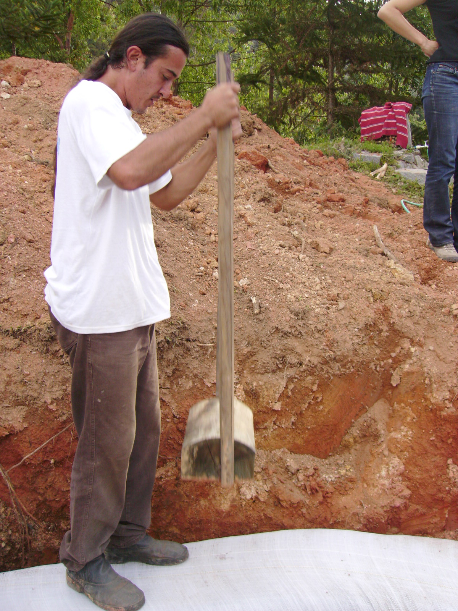
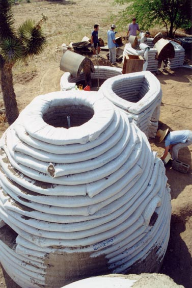

Le contenu de ce guide est participatif, n'hésitez pas à contribuer :-) !

# Autonomie

Vivre libre : guide de l’autonomie

Comme nous n’avons aucun pouvoir pour faire changer le système, alors nous pouvons nous en
passer tout simplement, et ne plus le financer. Sans consommateurs, le système n’existe plus. Les
plus optimistes se disent même que si ça marche pour eux, ça va inciter beaucoup de gens qui
n’avaient pas eu le courage de le faire ou qui n’en avaient pas eu l’idée à passer à l’acte, et de toute
façon, d’après certains autres, ce système n’en a plus pour longtemps.

J'essaye de rassembler dans un article tout ce qui pourrait aider ceux qui sont prêts à se lancer. Une sorte de petite encyclopédie des autonomistes.

Bien sûr, je ne connais pas tout, et si vous avez des infos, envoyez-les. C’est important pour nous de réapprendre les
anciennes techniques de construction, et pourquoi pas, les mélanger avec des nouvelles tant que c’est encore possible.

## La terre

Ce que tout aspirant autonomiste va devoir trouver en premier, c’est une terre. Et bien il y a trois solutions, a vous de choisir celle qui vous convient.

### Quelle surface est nécessaire ? 

Le plus difficile est de trouver un endroit se prêtant bien à la chose. On a besoin de moins que ce que l’on peut penser : un hectare de terre (100mx100m: 10.000m2), en fonction de sa qualité et de la façon dont il est cultivé, peut nourrir entre 5 et 35 personnes, soit quand même 20 personnes en moyenne.

Seulement 500 m2 de potager sur une terre moyenne, et vous êtes presque sur de n’avoir jamais faim. C’est déjà un sacré progrès que de ne plus subventionner l’industrie agroalimentaire, les supermarchés et tous les autres intermédiaires, et en plus là, c’est des vraies tomates. 

### L'acheter
Si on y réfléchit ça a l’air con, mais c’est comme ça ici depuis un moment, la terre s’achète. Le prix de terre classé `terre cultivable` est en moyenne de 5000€ l’hectare. Le prix varie beaucoup selon les régions.

Dans d’autres pays d’Europe et du monde, les prix sont **énormément** plus bas, si l’exil vous botte.

Selon la loi, ces terres sont `inconstructibles`, mais on a quand même le droit de construire sur chaque parcelle jusqu’à six locaux de 20m2 maximum, sur lesquels on n’aura pas d’impôts. Là-dessus, comme on est un peu des bandits, on peut jouer avec la loi et se faire une maison de six pièces reliées entre elles par des couloirs couverts sans murs. C’est légal, le problème c’est qu’il faudrait faire beaucoup plus de murs et chauffer plusieurs pièces. 

On peut aussi se faire classer comme structure touristique ou camping de moins de six places, quelques formalités en plus, mais là il est tout à fait légal d’installer des `structures démontables` comme les yourtes, caravanes ou bungalow (le terme `démontable` est un peu vague, et là aussi on peut jouer avec) et surtout, il n’y a pas d’impôts.

### Se la faire prêter
Il existe des associations qui peuvent vous permettre d’accéder à la terre pour vraiment pas cher, ou même gratuitement si vous rêvez de vous reconvertir dans l’agriculture bio (ou même mieux en permaculture) comme [terre de lien](https://terredeliens.org/spip.php?page=accueil), [passerelle éco](
http://www.passerelleco.info/) ou [le
mouvement colibri](http://www.colibris-lemouvement.org)

Si vous préférez vivre dans les bois, il y a aussi l’[Office National des Forêts (ONF)](http://www.onf.fr/) qui peut vous accorder un bail allant jusqu’à 99 ans pour être le garde forestier. (Souvent pas payé, faut pas rêver non plus) Avec l’autorisation, et même l’incitation à être autonome.

Ce sont des exemples, mais il y en a beaucoup d’autres, et si c’est ce que vous voulez il est possible avec un beau projet bien fait d’avoir votre petit chez vous autonomiste et un travail assuré.

### La squatter

Toutes les solutions présentées précédemment sont totalement légales, il en reste pourtant une dernière illégale mais tolérée. C’est la solution qui est de loin la moins chère, elle est gratuite.

Le `squat` de villages, abandonnés après l’exode rural. 

Parce qu’ils sont isolés au milieu de la campagne, en général en montagne dans des zones où le tracteur ne passe pas bien et où il n’y a pas de grandes étendues plates, personne ne viendra vous déloger tout simplement parce que personne n’a besoin de cette terre.

Il y reste des maisons encore debout, ou a minima les matériaux de construction qui vous seront utiles (pierres, tuiles, cuves, puits, etc). Autant de choses en moins à trouver, à construire ou à acheter faute de mieux.

## Fabriquer sa maison

Une règle toute bête pour construire pas cher, c’est de faire sois même. La deuxième règle c’est de se servir des matériaux disponibles à portée de main ou de récup.

On ne peut pas apprendre à faire une maison en un article, mais ce n’est quand même pas très compliqué, un peu de logique seulement. On peut aussi se faire aider par des gens qui s’y connaissent un peu plus en postant une annonce sur les sites de chantiers participatifs.

### En terre

Maintenant qu’on a une terre, ce qu’on peut trouver vraiment tout près, c’est la terre elle-même. 

La terre apporte une bonne inertie thermique (capacité à accumuler de la chaleur puis la restituer avec un décalage).

- 40% de l'humanité habite des constructions en terre crue (source UNCHS). 
- 17% des monuments inscrits au patrimoine mondial de l'humanité sont en terre crue : forteresses marocaines, pyramides d'Egyptes...
- On trouve dans nos régions : le pisé en Isère, l'adobe dans la région de Toulouse, le torchis dans les Landes, la bauge en Vendée..

Pour chacune des techniques dont je vais parler il existe aussi des tas de livres et de vidéos très bien faites destinées aux auto-constructeurs, et des forums comme ceux-là par exemple : 
- [Vivre la nature](http://vivrelanature.teamgoo.net/f17-fabriquer-un-abri)
- [On peut le faire](http://www.onpeutlefaire.com/forum/)

#### Tester les propriétés de sa terre

Si on veut construire en terre il va d’abord falloir tester la quantité d’argile que contient le sol.

##### Les différentes terres

La terre à bâtir est constituée de grains de différentes tailles (cailloux, graviers, sables, limons, argiles), d'air et d'eau. La terre à cultiver contient en plus de la matière organique (végétaux et animaux).

Les cailloux, graviers, sables et limons sont des grains plus ou moins arrondis de même nature. Seule leur taille varie et leur donne des noms différents.

Les argiles sont des particules très fines et aplaties. Elles réagissent avec l'eau pour coller tous les grains ensemble. Il en existe de plusieurs sortes (des colles très fortes et délicates à employer et des colles moins fortes, mais d'utilisation plus facile).

Les propriétés d'une terre viennent de la proportion de chacun de ses grains et du type d'argile.

###### Le gravier, les cailloux

Ils sont facilement reconnaissables par leur diamètre supérieur à 2 mm. Ils limitent les remontées d'eau par capillarité, c'est pourquoi ils sont utilisés dans les hérissons. Ils limitent aussi le retrait des liants qui les entourent, comme la terre ou le béton.

###### La terre sableuse

Une terre sableuse est une terre contenant une grande proportion de sable (particules de diamètre compris entre 0,06mm et 2mm). Le terrain sableux est très perméable. Il laisse donc facilement circuler l'eau sans gonfler et limite fortement les effets du gel. C'est une terre qui se draine automatiquement. L'eau assure la cohésion d'un sol. La terre sableuse manque donc de cohésion et s'effrite. Elle a une bonne capacité portante et est parfaite pour des fondations.

###### La terre limoneuse (grande proportion de silt)

La petite taille des particules de silt (entre 0,06 et 0,002mm) rend assez difficile la différenciation de la terre limoneuse avec l'argile. La terre limoneuse possède un bon degré de cohésion grâce à la friction des particules de silt. Cependant, en raison de leur perméabilité élevée, la terre limoneuse est plutôt sensible au gel.

###### La terre argileuse

La terre argileuse est souvent lourde car gonflée d'eau et a donc une grande inertie thermique. Elle est lente à se réchauffer au printemps, mais plus longue à se refroidir en hiver. Elle a donc tendance à adoucir le climat. Elle absorbe très lentement l'eau en gonflant et en devenant imperméable, elle la restitue aussi très lentement. Les pluies restent à sa surface en ravinant plus facilement tout autour.

###### La terre organique

On la trouve généralement dans les 35 premiers centimètres du sol. Parfois de couleur sombre : l'humus qui indique une décomposition avancée (appelée terre humifère), ou de couleur plus claire avec des parties végétales visibles. C'est une terre qui change fortement de volume avec l'eau. Elle accepte jusqu'à 5 fois son volume d'eau et perd ainsi toute stabilité mécanique.

##### tailles des particules :

Le nombre de sols différents est infini. On peut cependant les classer en fonction de leur pourcentage de particule de différentes tailles :
- la roche
- les cailloux de 200mm à 20mm
- les graviers de 20mm à 2mm
- les sables de 2mm à 0,06mm
- les silts 0,06mm à 0,002mm (donnent la terre limoneuse)
- les argiles de 0,002mm à 0,000001mm

#### Les tests d'identification

##### Le test du pif

C'est un test d'identification de consistance de la terre (grenu, fin).

Ça n'est pas le test le plus fiable, cependant c'est le test le plus simple, et il est assez performant pour la plupart des terres.

Séparer manuellement les gros cailloux et les graviers (supérieur à 2mm), si on a le courage les gros sables (supérieur à 1mm). On peut alors apprécier à l'oeil le pourcentage de chacune des familles et en déduire si le sol est grenu.

Avec cette méthode, on repère aussi assez facilement un sol organique. Elle donne une première impression : terre fine, lisse ou au contraire très rugueuse.

##### Le test du bocal

C'est un test d'identification de composition de la terre (gravier, sable, silt, argile, organique).

Le test du bocal est l'un des plus performants. Il repose sur une technique de sédimentation. Il permet de connaître le pourcentage volumique des cinq principales classes de particules d'une terre.

Le choix d'un bocal svelte est un gain énorme en précision, car le gain en hauteur se traduit par un espacement des couches.

- Remplier un bocal avec un quart de terre et compléter avec de l'eau pure en laissant un petit espace d'air pour agiter plus facilement
- Refermer et on agiter énergiquement
- Attendre une heure et agiter de nouveau
- Les sables se déposent presque immédiatement
- Après 45 minutes, on peut mesurer la couche de silt
- Au bout de 8 heures, les argiles se sont déposées, on peut mesurer les différentes hauteurs

##### Le test du toucher

Le toucher permet de bien sentir les sables. En ajoutant un peu d'eau, les sensations sont plus précises.

La terre limoneuse devient de plus en plastique. La terre argileuse devient complètement plastique et collante.

##### Le test du goût et de l'odeur

Voici le test des gourmands. On prend un petit peu de terre et on la renifle en l'écrasant puis on la mange.

Attention tout de même aux différentes pollutions.

- Si elle sent le moisi, c'est une terre organique. On peut vérifier nos déductions en humidifiant ou en chauffant la terre.
- Si elle laisse une impression pâteuse, colle au palais c'est une terre argileuse.
- Si elle ne colle pas, c'est une terre limoneuse.
- Si la terre crisse désagréablement sous les dents, c'est une terre sableuse.

##### Le test du lavage de main

Très simple. Il suffit juste de se laver les mains avec la terre.

- Si les mains se rincent facilement, c'est une terre sableuse.
- Si les mains laissent une impression de savon, difficile à rincer, c'est une terre argileuse.
- Entre les deux, c'est une terre limoneuse.

 ##### Le test d'adhérence à un couteau

C'est un test d'identification de consistance de la terre (fortement argileux, faiblement argileux, limoneux, sableux).

On fait une petite boule de terre humide de 3-4 cm de diamètre. On la malaxe jusqu'à ce qu'elle colle plus aux doigts. On enfonce la lame du couteau (comme pour tester si le gâteau est cuit).

- Si le couteau entre et sort facilement de la boule, tout en laissant des traces sur la lame, c'est une terre faiblement argileuse.
- Si le couteau s'enfonce difficilement, tout en laissant des traces sur la lame, c'est une terre fortement argileuse.
- Si la lame ressort indemne et presque propre, c'est une terre sableuse ou limoneuse. On coupe alors la boule en deux :
	- Si la lame crisse, la terre est sableuse.
	- Si l'éclat de la terre est brillant, la terre est limoneuse.

##### Le test du rouleau de terre

Il s'agit d'un test de consistance qui mesure essentiellement la proportion d'argile de la terre.

- Confectionner à partir de la terre fine une petite boule de 2-3 cm de diamètre humide mais non collante
- La rouler à la main
	- Si le cordon casse avant d'atteindre un diamètre de 3mm on rajoute un peu d'eau et on recommence
	- Si la terre se roule jusqu'au diamètre des trois millimètres sans se casser, on reforme la boule
		- Écraser la boule
		- Si la boule s'écrase sans se fissurer : c'est une terre fortement argileuse
		- Si la boule s'écrase en se fissurant de partout : c'est une terre faiblement argileuse
		- Si la boule est difficile à reformer : c'est une terre limoneuse
		- Si la boule est spongieuse : c'est une terre organique

#### Les tests des propriétés de la terre

##### Le test des pastilles

- Préparer différents mélanges de terre (différentes terres, ajouts de paille, ajouts de sable...)
- Placer les mélanges dans des moules
- Laisser sécher
- Lorsque c'est sec, observer comment ils se sont rétractés.
- Lorsque l'eau s'évapore, les plaquettes d'argiles se rapprochent et avec elles les autres grains : la terre se rétracte.

##### Le test de plasticité

La plasticité d'une terre est sa capacité à subir des déformations sans casser ou sans même se fissurer. Cette valeur évolue avec la quantité d'eau du matériau. Ce test permet de mettre en évidence l'influence de l'eau dans les mélanges.

Les argiles ont des formes de plaquettes et sont comparables à des plaques de verre.

- Prendre une quantité donnée de terre
- Ajouter une quantité d'eau différente pour chaque échantillon
- Essayer de faire une colonne la plus haute possible à l'aide des mains avec chaque mélange

- Si on met un peu d'eau entre deux plaques, on ne peut pas les décoller mais on peut les faire glisser l'une par rapport à l'autre
- Si il y a un peu d'eau entre toutes les plaquettes d'argile, la terre est plastique
- S'il n'y a pas assez d'eau, les plaquettes ne sont pas collées les unes avec les autres

Ces deux derniers tests montrent l'influence de l'eau et l'importance des amendements pour travailler une terre.

##### Le test des mélanges pour les enduits:

Afin d'éviter les fissurations dues au retrait ou l'effritement dans un enduit trop sableux, on amende notre terre avec des fibres (paille par exemple) et du sable.

- Préparer un mélange de terre.
- Sur un panneau ou pan de mur, réaliser une petite surface d'enduit.
- Créer une sorte de tableau en réalisant des surfaces d'enduits dans lesquels on ajoute progressivement plus de sable à l'horizontale et plus de fibres à la verticale.
- Ce qui permet d'observer les réactions en fonction des amendements et de choisir le mélange le plus approprié. 

#### En fonctions des résultats de votre terre

##### Beaucoup d'argile

Si vous avez plus de 40 ou 50% d’argile, alors vous pouvez monter directement des murs avec ça, ils tiendront des siècles comme ces vieilles maisons du moyen-âge encore debout aujourd’hui.

[(Au Yémen ils font des tours jusqu’à 60m de haut avec cette
technique. Pour dire que ça tient, et en plus c’est très joli)](http://www.linternaute.com/voyage/magazine/photo/yemen-la-beaute-farouche/hadramaout-couleur-terre.shtml). 

L’essentiel étant que l’eau de pluie ne ruisselle pas dessus, donc un toit qui déborde bien et un bon drainage autour de la maison.

##### Beaucoup de sable

Si vous avez beaucoup de sable il vous reste le super-adobe ou éco-dôme.

C’est comme les murs en sac de sable de l’armée (sacs en toile de jute ou en polypropylène tissé du genre sac à gravats), mais pour faire une maison. Ils sont maintenus solidaires entre eux par des barbelés, puis le tout est recouvert d’enduit. On trouve quelques info sur cette technique, mais pas assez. Si ça vous intéresse, le plus simple est d’acheter le livre de Nhader Kahlili, l’architecte qui a inventé ça. (la plupart des sites et des livres sont en anglais).

Les formes arrondies sont les plus pratiques, mais si vous préférez vous pouvez faire des carrés. L’intérêt du dôme est qu’il n’y a pas de structure en bois et que le toit est déjà fait.

Le rouleau de 500m de sac coûte de 500€ à 1000€, et avec ça on fait bien 50m2 (ça n’était tellement pas cher et tellement solide que l’ONU a refusé de l’utiliser pour les camps de refugiés de peur qu’ils ne s’installent définitivement) Attention il faut prendre des sacs solides.
- http://www.oxygenes.com/rouleau-sacs-polypro-2.php
- http://eco-dome.designblog.fr/
- ...

###### Le super Adobe

- Niveler le terrain afin qu´il soit complètement plat
- Tracer un cercle au sol par l´intermédiaire d´un pic placé au centre relié à un fil qui en tournant tracera la circonférence du cercle. Les formes ciculaires conviennent mieux à la technique du superadobe pour des raisons de stabilité.

- Mettre en place les fondations en remplissant des sacs en nylon ou en toile (usuels pour stocker l´alimentation) avec un mélange de 1/3 de ciment et de 2/3 de sable.

- Bien tasser

- Arroser la première couche constituée par le premier sac de la fondation avec de l´eau de façon à ce que le ciment prenne
- Mettre un barbelé au-dessus du sac pour éviter les mouvements latéraux du prochain sac, superposé à ce premier

- Remplir des sacs en nylon avec de la terre
- Compacter
- Mettre un barbelé au-dessus du sac
- Répéter jusqu'a la hauteur souhaitée

En incurvant selon un arc, la toiture peut être faite de sac de terre. On pourra fabriquer un arc de cercle ou un cadre en bois par exemple qui viendra soutenir les arcs.

Pour renforcer la terre et la rendre aussi résistante que le béton, il est possible de faire un grand feu à l´intérieur du dôme une fois la construction finie pour obtenir des murs en terre cuite.

Recouvrir le tout d´une bâche imperméabilisante pour éviter que l´eau ne s´infiltre dans les fondations au cours du temps.

Les murs peuvent également s´édifier sur des fondations en pierres.

### La maison en paille

Un peu plus cher mais bien mieux que n’importe quelle maison conventionnelle. C’est plus cher à cause de la structure en bois mais si vous avez l’argent pour l’acheter ou la possibilité de le trouver gratuitement c’est parfait. Vous pouvez aussi y construire en rond, et là pas besoin de structure.

Cela se monte tout seul, en quelque jours, mais il faut faire le toit avant les murs (ou bien bâcher contre la pluie pendant la construction)

http://fr.wikipedia.org/wiki/Maison_en_paille

Vous pouvez construire le mur en palette de récupération. Vous les remplissez de paille, vous enduisez d’un mélange argile/sciure/chaux sur les deux côtés et vous avez des murs isolés, jolis et montés en un clin d’œil.
http://www.habitat-eco-responsable.fr/2008/11/la-maison-palette/

### Les fondations

Une dernière petite technique de récupération, pour faire les fondations il est possible d'utiliser de vieux pneus de voiture, remplis de terre et de chaux à la masse, bien tassé, c’est très solide et ça ne bouge pas. 

Si le néo-classique vous tente on peut aussi imaginer faire des colonnades avec. Une fois enduit ça peut le faire.

### Le toit

Inutile pour l’éco-dôme justement parce qu’il n’y a pas de toit. Le dôme est tout simplement enduit à la chaux et lissé.

#### En terre cuite

A moins que vous ayez un four capable de chauffer à plus de 1000C°, vous ne pourrez pas faire de tuiles en terre cuite.

#### Tavaillon

Il reste le tavaillon, la tuile en bois. C’est étanche, ça dure une vingtaine d'année, facile à faire et à monter, pas cher et vous pouvez facilement changer quelques tuiles en cas de problème. Puis ça donne tout de suite un aspect sympathique. 

Comme l’eau n’est pas stagnante il n'est pas néccéssaire de traiter le bois. Vous aurez des problèmes pour la récupération d’eau de pluie si vous décidez de traiter le bois quand même, à moins que vous ne traitiez avec un produit naturel.

On peut aussi en recouvrir les murs si on trouve ça joli.
http://fr.wikipedia.org/wiki/Tavaillon

#### Toiture végétale

La toiture végétale est aussi une solution, mais ça prend du temps et ça demande des matériaux qu’on est obligé d’acheter. Voilà [un site](http://www.be-green.com/fr/news/eco/autoconstruction-toiture-vegetalisee-de-la-conception-a-la-realisation-_62/) qui répertorie les différentes toitures. C’est aussi comme ça qu’on fait une maison de Hobbit.

#### La tôle

La tôle, tout le monde comprend le concept... Ce n’est pas joli, mais pour la récupération d’eau c’est parfait (à vérifier que ça ne pollue pas l'eau) et c'est pas cher, puis c’est très rapide à poser.

#### Le toit terrasse
c’est de loin le plus compliqué à construire sous nos climats humides. Pas forcément le plus cher, juste le plus compliqué, mais ça peut être très chouette pour prendre l’apéro ^^
- http://www.maisons-et-bois.com/discussions/viewtopic.php?pid=146675
- http://www.forumconstruire.com/construire/topic-163092.php

Dans le deuxième ils abordent la question du prix.

## l'eau

Bon, maintenant que vous avez bien travaillé, vous avez votre maison, et vous prendrez bien un
petit verre

Il faut savoir que, comme pour la terre, on pense souvent qu’il nous en faut énormément alors que c’est faux. Il est intéressant de faire quelques calculs.

### Consommation d'une personne

Voyons très large.

#### Par jour
 - Boisson 3 litres
 - Se laver 50 litres 
 - Ménage 10 litres
 - Potager 100 litres 
On obtient 163 litres. Ce qui fait 0,163m3

#### Par an
0,163m3 multiplié par 365 jours :
0,163\*365 = 60m3 = 60 000L

Si vous voulez stockez pour deux semaines, vous devez donc pouvoir stocker 1582 litres, 1,582m3, arrondissons à 2000 litres, soit 2m3.

### La stocker

Le meilleur matériau de stockage de l’eau est la pierre calcaire ou le béton. Le béton (basique) permet de neutraliser l’acidité de l’eau de pluie et donc de la rendre potable. Si vous avez une cuve en acier ou en plastique (beurk) placez à l’intérieur un parpaing, ça fera le même office...

C’est mieux d’enterrer la cuve pour plusieurs raisons notamment la protection des UV du soleils.

### Production

#### Puit

#### Rivière

#### Pluie

L’eau de pluie est potable si elle est bien conservée, même si elle n’est pas minérale du tout. Vous trouverez les minéraux dans vos légumes de potager, qui eux en sont pleins.

### Recycler l'eau usagée

L’eau est une chose précieuse quand on ne la trouve pas au robinet. C’est pourquoi, même quand elle à été utilisée pour la vaisselle et le lavage, il ne faut pas la jeter bêtement par les fenêtres. Il est possible de retraiter l’eau de vaisselle ou de la douche (les eaux grises) en eau pour le potager.

#### Phyto-épuration

http://www.passerelleco.info/rubrique.php?id_rubrique=4
http://www.terrevivante.org/497-une-solution-alternative-la-phytoepuration.htm

## La salle de bain

### Chauffer l'eau

Une salle de bain, c’est déjà de l’eau chaude. Comment chauffer l’eau si on n’a ni électricité, ni gaz de ville ?

#### Le Chauffe eau solaire
##### De luxe
Pour construire un chauffe eau solaire, il vous faut un peu de matériel. Une caisse en bois ou en métal assez plate que vous isolerez sur le fond et les bords, une vitre ou un plexiglas, Des tuyaux, en cuivre de préférence, de la peinture noire mat et un ballon bien isolé pour stocker l’eau chauffée. La boite en bois isolée est peinte en noir à l’intérieur, la vitre est posée sur le dessus et les tuyaux, peints en noir aussi, serpentent dedans. L’eau à l’intérieur des tuyaux est en circuit fermé, et
serpente aussi dans la cuve, ce qui réchauffe l’eau. Au lieu de l’eau dans les tuyaux vous pouvez mettre du glycol, (liquide de refroidissement de voiture, qu’on retrouve aussi dans les mousses à raser et les chewing-gums « goût frais ») ça chauffe plus vite que l’eau, ça ne boue pas et ça vous évitera de devoir faire la vidange en hiver puisque ça ne gèle pas non plus. Un dessin vaut milles mots :
http://www.mon-chauffe-eau-solaire.com/
http://zouaoui.club-sciences.over-blog.com/article-systeme-solaire-thermique-66649105.html
http://www.solaire-chauffe-eau.info/panneau-solaire-thermique.html#introduction

Sur ces sites ça parait très compliqué, mais en fait c’est très simple et vous n’êtes pas obligé te tout
faire.

**Attention en été la température de l’eau du ballon peut monter jusqu’à l’ébullition.** Si vous avez un ballon électrique, il y a dessus une soupape de sécurité que vous pouvez utiliser et qui vidange le ballon si l’eau y est trop chaude.

##### De récupération
Plein de bouteilles en plastique, pleins de cannettes en métal, n’importe quel tuyau, et une bassine 
http://blog.ecoexperimentos.com.ar/2012/01/calentador-solar-gratis-con-botellas.html

(C’est en espagnol, mais il y a tout les dessins qu’il vous faut pour comprendre comment ça
marche.)

#### La méthanisation

voir [la méthanisation](#la-méthanisation-1)

### Lavabo, évier, bac de douche, carrelage, ...

Pour fabriquer sois même son évier, bac de douche, baignoire, carrelage enduit de salle de bain ou de cuisine

#### Le tadelakt

C'est juste de la chaux et du savon et une petite technique Marocaine. Y’a pleins de vidéo et de bouquins si ça vous intéresse. 
http://fr.wikipedia.org/wiki/Tadelakt

## Les toilettes

Au lieu de gaspiller 9L d'eau par tirage de la chasse...

### Le trou au fond du jardin

#### Les toilettes sèches

Cela ne néccéssite qu'un bac et de la sciure. C’est tout bête et ça ne sent rien. **N’utilisez pas de papier
blanchit ou teint si vous voulez le jeter dedans aussi.**

Puisque c’est des matières organiques, si ça ne vous dégoûte pas trop, on peut en faire du méthane avec la méthode Jean Pain.

On peut le composter et le renvoyer dans le potager, mais attention, il doit composter un an avant de pouvoir l’utiliser pour être sur qu’il n’y ait plus aucunes bactéries pathogène. Je vous conseille le compostage en tas allongé, mélangé à de la paille plutôt que dans un bac. C’est juste beaucoup plus pratique pour le retourner tout les six mois. Pas d’inquiétude, si votre compost est bien fait il ne sent pas mauvais.

## Nourriture

### Permaculture

#### Compostage

##### La méthanisation

Je vous conseille de télécharger ou d’acheter [le bouquin](http://www.ebooks.telechargementgratuits.com/telecharger-LES_METHODES_JEAN_PAIN--76363.html) de la méthode Jean Pain, un vrais génie ce gars là.

C'est faire fermenter dans l’eau et dans une cuve étanche des matières organiques. La fermentation produit un gaz, le méthane. C’est un gaz très inflammable et inodore, donc parfait pour la cuisine ou le chauffage. La cuve est raccordée par un tuyau à un ballon (des chambres de camion ou de tracteur, c’est parfait) et une fois que le ballon est plein, vous n’avez plus qu’à l’utiliser. Apparemment ça produit beaucoup de gaz pour pas beaucoup de travail. (Mais je n’ai pas encore essayé, ça ne saurait tarder.) La matière organique fermentée peut être utilisée ensuite pour faire du compost. Rien ne se perd.

Il est possible d'utiliser cette méthode pour chauffer la maison grâce au compost.

##### La paille activée
On fait un tas de paille, on la mouille avec de l’eau et on danse dessus pendant dix minutes à plusieurs en chantant des chansons. (Les chansons ne sont pas obligatoires mais recommandées ^^) pour séparer les fibres et les imprégner d’eau. La paille composte ainsi deux fois plus vite.

#### Zonage

### Potager
Je ne peux que vous encourager à lire « la révolution d’un seul brin de paille » de Masanobu Fukuoka.
Voilà pour les fainéants :

### Cuisson

#### le feu

Néccéssite du combustible

#### Solaire

Ça marche vraiment super bien et ça évite la corvée de bois.

Sur ce site, 21 prototypes.
http://solarcooking.org/francais/plans.htm

##### les fours

##### les paraboles

## Énergie

On peut utiliser le méthane créé à l'aide de la méthode Jean Pain pour faire tourner un groupe électrogène

Pour compléter un peu, voila un lien donné par le mouton Badboy pour une 50aines de machines à construire soi-même, dont plusieurs machines pour l’énergie : http://chroniquedelinfo.wordpress.com/2012/11/13/open-source-ecology/

## Dons

Si il vous manque des matériaux, vous pourrez peut être les trouver sur les sites de dons. Il suffit de s’inscrire.
- http://donnons.org/
- http://fr.freecycle.org/accueil/

## D'autres liens à explorer pour enrichir ce guide

Ce site là, donné par domi26 est une mine d’or ! Il y a TOUT ou presque!
http://www.habiter-autrement.org/index.htm
Allez donc faire le tour des sites et des forums survivaliste. Ils sont peut être un peu près de leur flingue mais ils ont de bonnes idées.
La carte de leur réseau, fournie par Ikyro :
https://maps.google.fr/maps/ms?msid=201343372535628073587.0004c5c0e9afeea857c66&msa=0&ll=48.709088%2C2.246704&spn=3.157243%2C8.453979
Et quelques sites :
http://fr-fr.facebook.com/pages/RSF-MERE/395455927137280
http://www.survivalisme-attitude.com/
http://lesurvivaliste.blogspot.fr/2012/09/reseau-survivaliste-francophone-forum.html
Et d’autres comme celui là :
http://www.onpeutlefaire.com/forum/
Et pour terminer, et surtout pour vous donner envie de vous lancer le plus vite possible : http://www.youtube.com/watch?v=SpDAoOUkfo8
Une conférence Inculture sur la fin du pétrole.

Il y a pleins de truc que j’ai oublié sans doute, mais il y à là l’essentiel. Ça m’a fait réviser et j’espère que ça sera utile à quelqu’un. L’autonomie est possible ! C’est pas la vie de château, mais mieux, et pour tout le monde. Du fauché intégral à celui qui a des économies. On n’a pas besoin d’être riche pour se lancer, ni d’être un bon bricoleur, il suffit d’en avoir envie et d’y aller. Le premier pas est le seul qui soit difficile. C’est ça que je voulais montrer.
